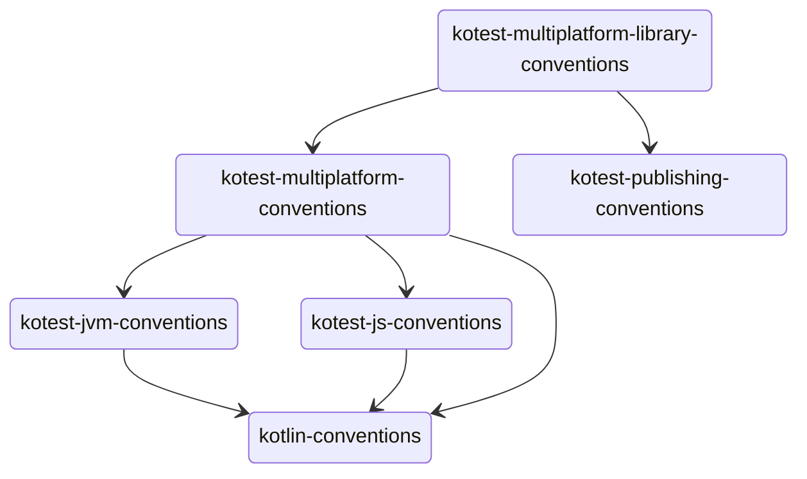

# Convention plugins

## Kotlin conventions

Configures a base project which uses kotlin-multiplatform (with no targets specified).

Here we configure anything that should apply to _every_ project, such as common plugins, repositories which should be
used, etc.

## Kotest JVM conventions
Adds a JVM target and sets basic JVM options

## Kotest JS conventions
Adds JS targets

## Kotest Multiplatform conventions
Adds _all_ multiplatform targets

## Kotest publishing conventions
Adds everything related to signing and publishing the libraries

## Kotest Multiplatform library conventions
A published library which uses all multiplatform targets. Adds signing and all multiplatform targets.
