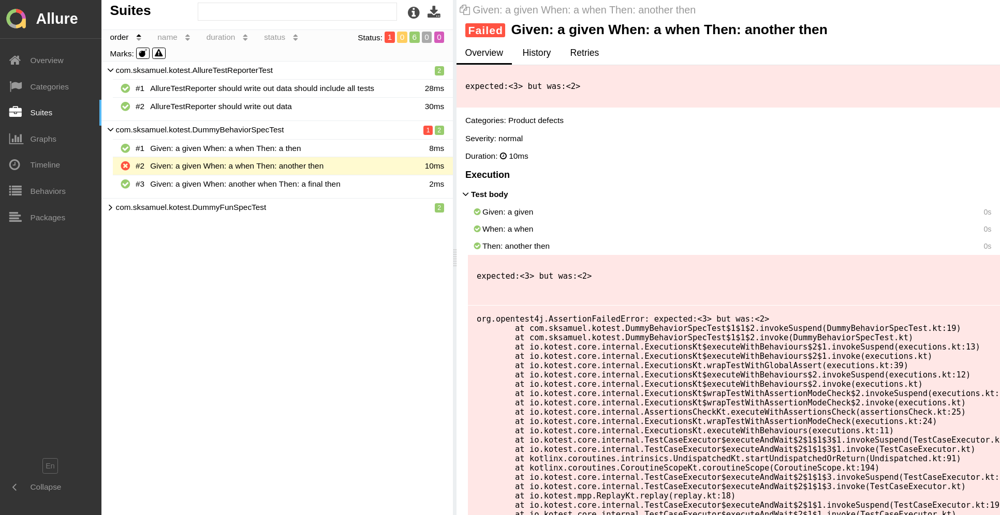

Allure
==========

[Allure](http://allure.qatools.ru) is an open-source framework designed for detailed and interactive test reports.
It works by generating report files which are then used to create the final HTML report.
You can think of it as like the traditional junit report but more advanced and detailed.

There are two steps to allure. The first is to generate the raw data when executing tests, the second is to
compile that data into the interactive HTML report.


### Collect Data

Allure has data collectors for most test frameworks, and Kotest is no different. In order
to activate allure for kotest, you first need to add the module `kotest-extensions-allure` to your build.

Next, wire in the `AllureTestReporter` class globally using [project config](project_config.md).

```kotlin
class MyConfig : AbstractProjectConfig {
    override fun listeners() = listOf(AllureTestReporter())
}
```

Now, whenever tests are executed, Kotest will write out test data in the allure json format.


### Gradle Plugin

Now that the tests have completed, we can compile them into the [final report](https://docs.qameta.io/allure/#_report_generation).

This can be done manually using the allure binary, or we can use the [allure gradle plugin](https://github.com/allure-framework/allure-gradle).
To use the gradle plugin, first add the plugin to your build's plugins block.

```kotlin
plugins {
   ...
   id("io.qameta.allure") version "2.8.1"
}
```

Next, add an allure configuration section to set the version and disable autoconfigure (because allure can only auto configure junit and kotest takes care of this for you anyway).

```kotlin
allure {
   autoconfigure = false
   version = "2.13.1"
}
```

Finally, execute the gradle task `allureReport` and the report will be generated in `./build/reports/allure-report` and inside  you should find the index.html entry point for the report.


### Setting Build Dir


If you are not using the gradle plugin then you will need to inform Allure where the build dir is by setting the `allure.results.directory` system property on your tests configuration. If you are using the gradle plugin, then this can be skipped as the gradle plugin does this for you.


For example:
```
tasks.named<Test>("test") { // or "jvmTest" etc
   useJUnitPlatform()
   systemProperty("allure.results.directory", project.buildDir.toString() + "/allure-results")
}
```


### Final Report

If all was successful, after test execution and report generation, you will see something like this:



