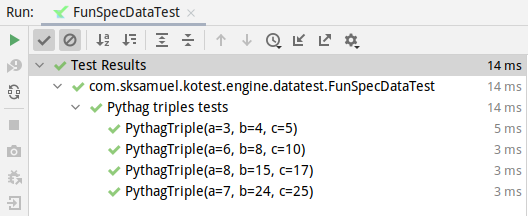
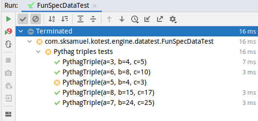
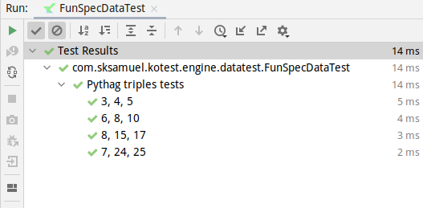

:::note
This section covers the new and improved data test support that was released with Kotest 4.3.0. To view the
documentation for the previous data test support, [click here](data_driven_testing_4.2.0.md)
:::

When writing tests that are logic based, one or two directed examples that work through specific scenarios make sense.
Other times we have tests that are example based, and we want to provide many combinations of parameters.

In these situations, **data driven testing** (also called table driven testing) is an easy technique to avoid tedious
boilerplate.

Kotest has support for data driven testing built into the framework. This means it will automatically generate the test
case entries, based off input values provided by you.

Let's consider writing tests for a [pythagorean triple](https://en.wikipedia.org/wiki/Pythagorean_triple) function that
returns true if the input values are valid triples.

```kotlin
fun isPythagTriple(a: Int, b: Int, c: Int): Boolean = a * a + b * b == c * c
```

We start by writing a data class that will hold each _row_ of values.

```kotlin
data class PythagTriple(val a: Int, val b: Int, val c: Int)
```

Next we invoke the function `forAll` inside a test case, passing in one or more of these data class _rows_, and a lambda
that performs some test logic for a given _row_.

```kotlin
context("Pythag triples tests") {
   forAll(
      PythagTriple(3, 4, 5),
      PythagTriple(6, 8, 10),
      PythagTriple(8, 15, 17),
      PythagTriple(7, 24, 25)
   ) { (a, b, c) ->
      isPythagTriple(a, b, c) shouldBe true
   }
}
```

Because we are using data classes, the input row can be destructured into the member properties.

:::note
Data driven testing can be used within any spec but must always be invoked inside a container test.
:::

Kotest will automatically generate a test case for each input row, as if you had manually written a seperate test case
for each.



If there is an error for any particular input row, then the test will fail and Kotest will output the values that
failed. For example, if we change the previous example to include the row `PythagTriple(5, 4, 3)`
then that test will be marked as a failure.



The error message will contain the error and the input row details:

`Test failed for (a, 5), (b, 4), (c, 3) expected:<9> but was:<41>`

:::tip
There is the inverse of `forAll`, called `forNone` which verifies that _none_ of the rows pass the test.
:::

## Custom Test Names

By default, the name of each test is simply the `toString()` on the input row. However we can customize this if we wish,
by passing in test names into the forAll / forNone functions.

```kotlin
context("Pythag triples tests") {
   forAll<PythagTriple>(
      "3, 4, 5" to PythagTriple(3, 4, 5),
      "6, 8, 10" to PythagTriple(6, 8, 10),
      "8, 15, 17" to PythagTriple(8, 15, 17),
      "7, 24, 25" to PythagTriple(7, 24, 25)
   ) { (a, b, c) ->
      a * a + b * b shouldBe c * c
   }
}
```

Note that currently, you must also specify the data class type.

The output from this example is now slightly clearer:



Whether this is worth the extra effort depends on how readable the toString() method is on the data classes you are
using.
