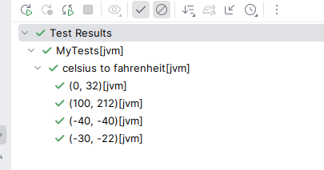

By default, the name of each test is simply the `toString()` on the input row. This typically works well for data
classes.

However, we can customize this if we wish, by passing in test names into the `withData` function in the form of map,
where the key is the test name, and the value is the input value for that row.

```kotlin
context("Pythag triples tests") {
  withData(
    mapOf(
      "3, 4, 5" to PythagTriple(3, 4, 5),
      "6, 8, 10" to PythagTriple(6, 8, 10),
      "8, 15, 17" to PythagTriple(8, 15, 17),
      "7, 24, 25" to PythagTriple(7, 24, 25)
    )
  ) { (a, b, c) ->
    a * a + b * b shouldBe c * c
  }
}
```

Or we can pass a function to `withData` which take `row` as input and return the test name.

```kotlin
context("Pythag triples tests") {
  withData(
    nameFn = { t: PythagTriple -> "${t.a}__${t.b}__${t.c}" },
    PythagTriple(3, 4, 5),
    PythagTriple(6, 8, 10),
    PythagTriple(8, 15, 17),
    PythagTriple(7, 24, 25)
  ) { (a, b, c) ->
    a * a + b * b shouldBe c * c
  }
}
```

The output from this example is now slightly clearer:



## WithDataTestName

Another alternative is to implement the `WithDataTestName` interface. When provided, the `toString()` will not be used,
instead the `dataTestName` function will be invoked for each row.

```kotlin
data class PythagTriple(val a: Int, val b: Int, val c: Int) : WithDataTestName {
  override fun dataTestName() = "$a, $b, $c"
}
```

## Test Name Function

Finally, another option is to provide a function directly to the `withData` method.

```kotlin
context("Pythag triples tests") {
  withData<PythagTriple>(
    { "${it.a}, ${it.b}, ${it.c}" },
    PythagTriple(3, 4, 5),
    PythagTriple(6, 8, 10),
    PythagTriple(8, 15, 17),
    PythagTriple(7, 24, 25)
  ) { (a, b, c) ->
    a * a + b * b shouldBe c * c
  }
}
```

Whether this is worth the extra effort or not depends on how readable the toString() method is on the data classes you
are using.

