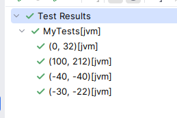

:::tip Module Changes
Prior to kotest 6.0, data-driven-testing was a separate module. Starting from kotest 6.0, data-driven-testing is
included in the core framework so there is no `kotest-framework-datatest` to be added. Please remove that from your build.
:::

:::note
This section covers the new and improved data driven testing support that was released with Kotest 4.6.0.
To view the documentation for the previous data test support, [click here](data_driven_testing_4.2.0.md)
:::

:::caution
If you are using data testing on kotlin-native platforms, and you only have data tests (ie, zero manual tests) then see the section on Native Support.
:::


When writing tests that are logic based, one or two specific code paths that work through particular scenarios make
sense. Other times we have tests that are more example based, and it would be helpful to test many combinations of
parameters.

In these situations, **data driven testing** (also called table driven testing) is an easy technique to avoid tedious
boilerplate.

Kotest has first class support for data driven testing built into the framework.
This means Kotest will automatically generate test case entries, based on input values provided by you.

## Getting Started

Let's consider writing tests for a [pythagorean triple](https://en.wikipedia.org/wiki/Pythagorean_triple) function that
returns true if the input values are valid triples (_a squared + b squared = c squared_).

```kotlin
fun isPythagTriple(a: Int, b: Int, c: Int): Boolean = a * a + b * b == c * c
```

Since we need more than one element per row (we need 3), we start by defining a data class that will hold a single _
row_ of values (in our case, the two inputs, and the expected result).

```kotlin
data class PythagTriple(val a: Int, val b: Int, val c: Int)
```

We will create tests by using instances of this data class, passing them into the `withXXX` function, which also
accepts a lambda that performs the test logic for that given _row_.

For example:

```kotlin
class MyTests : FunSpec({
  context("Pythag triples tests") {
    withContexts(
      PythagTriple(3, 4, 5),
      PythagTriple(6, 8, 10),
      PythagTriple(8, 15, 17),
      PythagTriple(7, 24, 25)
    ) { (a, b, c) ->
      isPythagTriple(a, b, c) shouldBe true
    }
  }
})
```

Notice that because we are using data classes, the input row can be destructured into the member properties.
When this is executed, we will have 4 test cases in our input, one for each input row.

Kotest will automatically generate a test case for each input row, as if you had manually written a separate test case
for each.



The test names are generated from the data classes themselves but can be [customized](test_names.md).

If there is an error for any particular input row, then the test will fail and Kotest will output the values that
failed. For example, if we change the previous example to include the row `PythagTriple(5, 4, 3)`
then that test will be marked as a failure.


The error message will contain the error and the input row details:

`Test failed for (a, 5), (b, 4), (c, 3) expected:<9> but was:<41>`

In that previous example, we wrapped the `withContexts` call in a parent test, so we have more context when the test results appear.
The syntax varies depending on the [spec style](../styles.md) used - here we used _fun spec_ which uses context blocks for containers.
In fact, data tests can be nested inside any number of containers.

But this is optional, you can define data tests at the root level as well.

For example:

```kotlin
class MyTests : FunSpec({
  withContexts(
    PythagTriple(3, 4, 5),
    PythagTriple(6, 8, 10),
    PythagTriple(8, 15, 17),
    PythagTriple(7, 24, 25)
  ) { (a, b, c) ->
    isPythagTriple(a, b, c) shouldBe true
  }
})
```

:::caution
Data tests can only be defined at the root or in container scopes. They cannot be defined inside leaf scopes.
:::

### Native Support

If you are using data testing on kotlin-native platforms, and you only have data tests (ie, zero manual tests) then you must instruct
the Kotlin gradle plugin to not fail the build because _no tests are discovered_. This happens because data tests are generated at runtime by Kotest,
the kotlin-native test discovery mechanism does not see any tests at compile time. Again, this only matters if you are using data tests exclusively.

```kotlin
tasks.withType<KotlinTest>().configureEach {
  failOnNoDiscoveredTests = false
}
```

### Callbacks

If you wish to have before / after callbacks in data-driven tests, then you can use the standard `beforeTest`
/ `afterTest` support. Every test created using data-driven testing acts the same way as a regular test, so all standard callbacks work as if
you had written all the test by hand.

For example:

```kotlin
beforeTest {
  // reset test setup
}

context("...") {
  withContexts(X, Y, Z) { x,y,z ->
    // test code
  }
}
```

### WithXXX Variants

Kotest provides a variety of `withXXX` functions to support different input types, and they change
per [spec style](../styles.md).

Each spec style has its own set of `withXXX` functions, and the standard `withData` which points to an appropriate
variant for that spec style.

Combinations per spec style are listed below:

| Test Style       | Available `withXXX` Functions                                                                                                                                                                                                      | Legacy `withData` Maps To |
|------------------|------------------------------------------------------------------------------------------------------------------------------------------------------------------------------------------------------------------------------------|---------------------------|
| **FunSpec**      | `withContexts` (creates container contexts)<br/>`withTests` (creates leaf tests)                                                                                                                                                   | `withContexts`            |
| **StringSpec**   | `withData` (creates leaf tests)                                                                                                                                                                                                    | `withData` (native)       |
| **DescribeSpec** | `withContexts` (creates container contexts)<br/>`withDescribes` (creates container describes)<br/>`withIts` (creates leaf tests)                                                                                                   | `withContexts`            |
| **ShouldSpec**   | `withWhens` (creates container contexts)<br/>`withShoulds` (creates leaf tests)                                                                                                                                                    | `withContexts`            |
| **WordSpec**     | `withWhens` (creates when containers)<br/>`withShoulds` (creates should containers)                                                                                                                                                | `withWhens`               |
| **BehaviorSpec** | `withContexts` (creates container contexts)<br/>`withGivens` (creates given containers)<br/>`withWhens` (creates when containers)<br/>`withThens` (creates then leaf tests)<br/>`withAnds` (creates and containers in given scope) | `withContexts`            |
| **FreeSpec**     | `withData` (creates containers)                                                                                                                                                                                                    | `withData` (native)       |
| **ExpectSpec**   | `withContexts` (creates container contexts)<br/>`withExpects` (creates leaf expect tests)                                                                                                                                          | `withContexts`            |
| **FeatureSpec**  | `withFeatures` (creates feature containers)<br/>`withScenarios` (creates leaf scenario tests)                                                                                                                                      | `withFeatures`            |

Examples of how these are used can be found in these kotest [tests](https://github.com/kotest/kotest/tree/master/kotest-framework/kotest-framework-engine/src/jvmTest/kotlin/io/kotest/datatest/styles)
