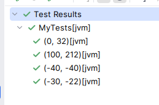
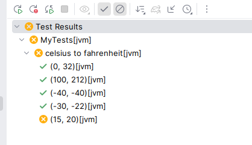
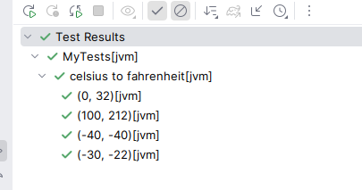
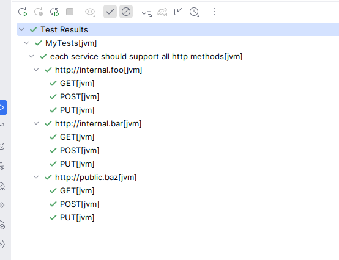

:::tip Module Changes
Prior to kotest 6.0, data-driven-testing was a separate module. Starting from kotest 6.0, data-driven-testing is
included in the core framework so there is no `kotest-framework-datatest` to be added. Please remove that from your build.
:::

:::note
This section covers the new and improved data-driven testing support that was released with Kotest 4.6.0.
To view the documentation for the previous data test support, [click here](data_driven_testing_4.2.0.md)
:::

:::caution
If you are using data testing on kotlin-native platforms, see the section on Native Support.
:::


When writing tests that are logic-based, then specific code paths that work through particular scenarios make
sense. Other times we have tests that are more example-based, and it would be helpful to test many combinations of
parameters.

In these situations, **data driven testing** (also called table-driven testing) is an easy technique to avoid tedious
boilerplate.

Kotest has first-class support for data-driven testing built into the framework.
This means Kotest will automatically generate test case entries, based on input values provided by you.

## Getting Started

When creating data tests, we need to provide each set of inputs (called a _row_) wrapped in a class passed to a
data test function. Depending on the spec style in use, these data test functions are named `withXXX` which mirror
the DSL provided by each [spec style](../styles.md). For example, if we are using the _fun spec_ style, which
uses the `test` keyword to define tests, then we would use the `withTests` function for data tests.

Let's consider writing tests for a Celsius to Fahrenheit conversion function. The input will be the Celsius value,
and the expected output will be the Fahrenheit value.

```kotlin
fun cToF(celsius: Int): Int = (celsius * 9 / 5) + 32
```

Since in this example we need two arguments per row, so we can wrap the inputs in a Kotlin `Pair` object. If we had
more than two arguments, we could use a custom data class instead.

We create a data test by using the `withTests` function, passing in the rows, and also a lambda that performs the test
logic for each given _row_.

For example:

```kotlin
class MyTests : FunSpec({
  withTests(
    Pair(0, 32),
    Pair(100, 212),
    Pair(-40, -40),
    Pair(-30, -22),
  )
  { (celsius, fahrenheit) ->
    cToF(celsius) shouldBe fahrenheit
  }
})
```

Notice that the input row can be destructured directly into the member properties.

Kotest will automatically generate a test case for each input row, as if you had manually written a separate test case.
So, in this example when this data test is executed, we will have four separate test results in our output.



The test names are generated from the data classes themselves but can be [customized](test_names.md) if desired.

If there is an error for any particular input row, then the test will fail and Kotest will output the values that
failed. For example, if we change the previous example to include the row `Pair(15, 20)`
then that test will be marked as a failure as 15C is not 20F.



The error message will contain the error and the input row details:

`Test failed for (a, 5), (b, 4), (c, 3) expected:<9> but was:<41>`

:::tip
Versions of Kotest prior to 6.1 provided a single `withData` function. This function still exists and points to an
appropriate variant for that spec style. However, the new withXXX variants are preferred as you have control over
whether you are defining a container or a leaf test.
:::


## Nesting

In the previous example, we placed the data tests at the root level. We can also nest data tests inside containers
For example, we can wrap the previous example in the `context` block that FunSpec provides so we have more
information when the test results appear.

For example:

```kotlin
class MyTests : FunSpec({
  context("celsius to fahrenheit") {
    withTests(
      Pair(0, 32),
      Pair(100, 212),
      Pair(-40, -4),
      Pair(-30, -30),
    )
    { (celsius, fahrenheit) ->
      cToF(celsius) shouldBe fahrenheit
    }
  }
})
```



In fact, data tests can be nested inside any number of containers, including other data tests. This allows us to
build up complex combinations of inputs.

For example, imagine we wanted to test a HTTP call with multiple methods. We could have the services at one level,
and the methods at the next level.

```kotlin
class MyTests : FunSpec({
  context("each service should support all http methods") {
    val services = listOf(
      "http://internal.foo",
      "http://internal.bar",
      "http://public.baz"
    )
    val methods = listOf("GET", "POST", "PUT")

    // First level of data nesting
    withData(services) { service ->
      // Second level of data nesting (Cartesian product)
      withData(methods) { method ->
        // Test logic: check if 'service' supports 'method'
        // e.g., apiClient.call(service, method).status shouldBe 200
      }
    }
  }
})
```



:::caution
Data tests can only be defined at the root level or in container scopres. They cannot be defined inside leaf scopes.
:::

### Native Support

If you are using data testing on kotlin-native or kotlin-js platforms, then you must ensure your inner most scope is
a _leaf_ level scope. This is because native and js platforms do not support _container_ tests without a _leaf_
test inside. This just means if you're using _fun spec_ for example, use `withTests` as your final level of nesting.

## Lifecycle Hooks

If you wish to have before / after hooks take effect for each row in a data test, then you can use the standard hooks
that Kotest supports, including `beforeTest` and `afterTest` for example. Every test created using data-driven testing
acts the same way as the equivalent regular tests, so all standard callbacks work as if you had written all the tests by
hand. See [docs on lifecycle hooks](../lifecycle_hooks.md)

For example:

```kotlin
beforeTest {
  // reset test setup
}

context("...") {
  withTests(X, Y, Z) { x,y,z ->
    // test code
  }
}
```

## WithXXX Variants

Each spec style has its own set of `withXXX` which define either a container or a leaf context.
Combinations per spec style are listed below:

| Test Style       | Available `withXXX` Functions                                                                                                                                                                                                      | Legacy `withData` Maps To |
|------------------|------------------------------------------------------------------------------------------------------------------------------------------------------------------------------------------------------------------------------------|---------------------------|
| **FunSpec**      | `withContexts` (creates container contexts)<br/>`withTests` (creates leaf tests)                                                                                                                                                   | `withContexts`            |
| **StringSpec**   | `withData` (creates leaf tests)                                                                                                                                                                                                    | `withData` (native)       |
| **DescribeSpec** | `withContexts` (creates container contexts)<br/>`withDescribes` (creates container describes)<br/>`withIts` (creates leaf tests)                                                                                                   | `withContexts`            |
| **ShouldSpec**   | `withContexts` (creates container contexts)<br/>`withShoulds` (creates leaf tests)                                                                                                                                                 | `withContexts`            |
| **WordSpec**     | `withWhens` (creates when containers)<br/>`withShoulds` (creates should containers)                                                                                                                                                | `withWhens`               |
| **BehaviorSpec** | `withContexts` (creates container contexts)<br/>`withGivens` (creates given containers)<br/>`withWhens` (creates when containers)<br/>`withThens` (creates then leaf tests)<br/>`withAnds` (creates and containers in given scope) | `withContexts`            |
| **FreeSpec**     | `withContexts` (creates container contexts)<br/>`withTests` (creates leaf tests)                                                                                                                                                   | `withContexts`            |
| **ExpectSpec**   | `withContexts` (creates container contexts)<br/>`withExpects` (creates leaf expect tests)                                                                                                                                          | `withContexts`            |
| **FeatureSpec**  | `withFeatures` (creates feature containers)<br/>`withScenarios` (creates leaf scenario tests)                                                                                                                                      | `withFeatures`            |

Full examples of how each of these can be used can be found in these kotest [tests](https://github.com/kotest/kotest/tree/master/kotest-framework/kotest-framework-engine/src/jvmTest/kotlin/io/kotest/datatest/styles)
