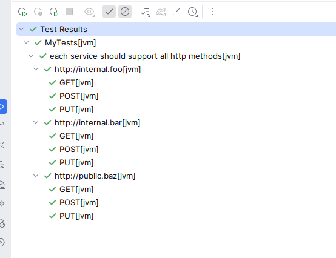

Kotest's data testing is extremely flexible and allows to unlimited nesting of data test constructs.
Each extra nest will create another layer of nesting in the test output providing the cartesian join of all inputs.
Please note that while `StringSpec` supports `withData`, this spec does not support `Nested Data Tests`.

For example, in the following code snippet, we have two layers of nesting.

```kotlin
context("each service should support all http methods") {

  val services = listOf(
    "http://internal.foo",
    "http://internal.bar",
    "http://public.baz",
  )

  val methods = listOf("GET", "POST", "PUT")

   withData(services) { service ->
     withData(methods) { method ->
       // test service against method
     }
   }

}
```

This would give output in intellij like:



And then here is the same example, but this time with a [custom test name](test_names.md) on the second level:

```kotlin
context("each service should support all http methods") {

    val services = listOf(
       "http://internal.foo",
       "http://internal.bar",
       "http://public.baz",
    )

    val methods = listOf("GET", "POST", "PUT")

    withData(services) { service ->
       withData<String>({ "should support HTTP $it" }, methods) { method ->
          // test service against method
       }
    }
}
```


