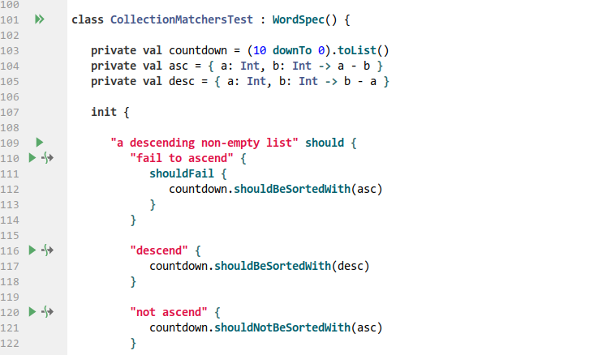
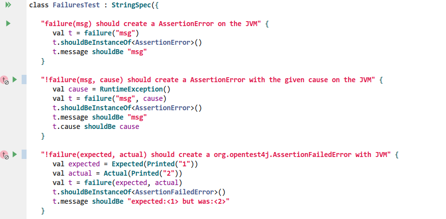
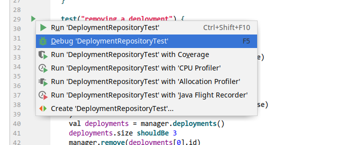
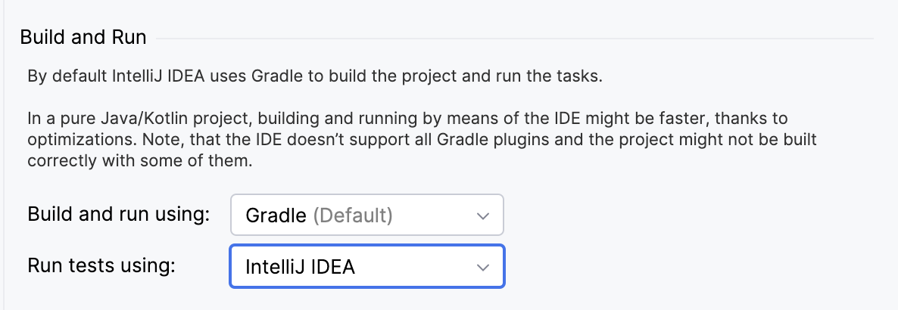
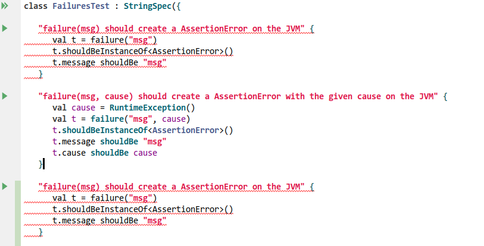
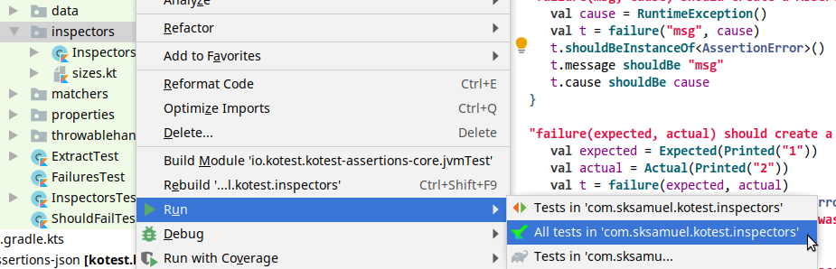
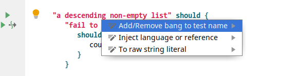
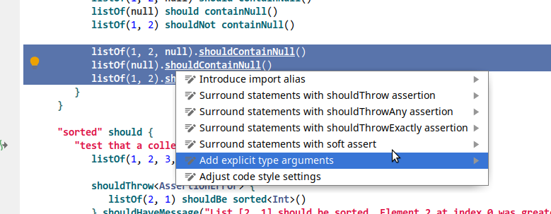

Kotest offers an [IntelliJ plugin](https://github.com/kotest/kotest-intellij-plugin) available at the jetbrains plugin [marketplace](https://plugins.jetbrains.com/plugin/14080-kotest) (search from within IntelliJ).

This plugin provides run icons for each test, a tool window for test navigation, duplicated test highlighting, assertion intentions, and more.

:::note
The Intellij plugin requires Kotest 4.2 or higher and will not run common tests of a multiplatform project
:::

## Gutter Icons

The plugin provides gutter run icons for specs, top level tests, and nested tests.

Any tests disabled via a bang or by _xfunctions_ such as `xdescribe`, will have a disabled test icon in the gutter.

## Running Tests

If you execute a spec from the gutter icon, then all tests in that spec will be executed.
If you execute a test, then that test and all nested tests will be executed.

:::note
For Gradle based projects: to run tests with the KoTest runner ensure your project's Gradle Settings are set to run tests with IntelliJ, not Gradle:

:::

## Duplicated Test Highlighting

You cannot have two tests with the same name. The plugin will highlight any duplicated test names as errors.

## Context Menu Run / Debug

Right clicking on a package will allow you to run, debug or run with coverage all the tests inside that package.

## Intentions

This plugin has some basic intentions. For example, you can quickly mark a test as disabled.

Or you can highlight some text and mark it as should throw, or surround with a soft assertion block.

