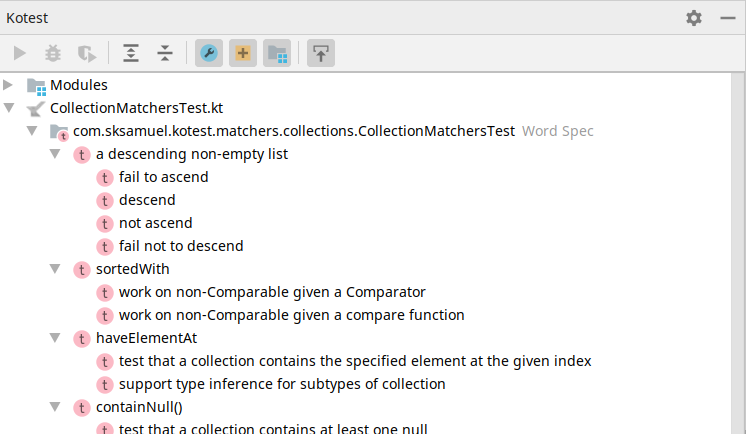
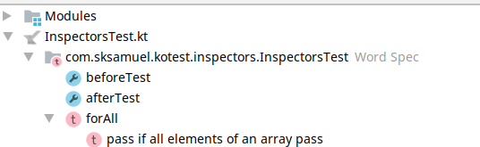
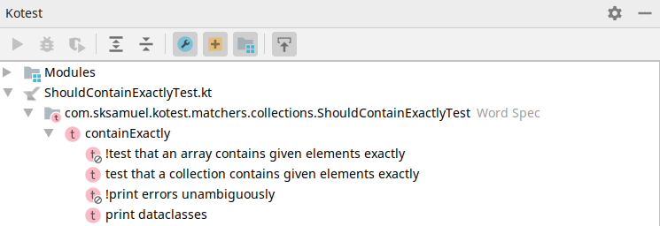
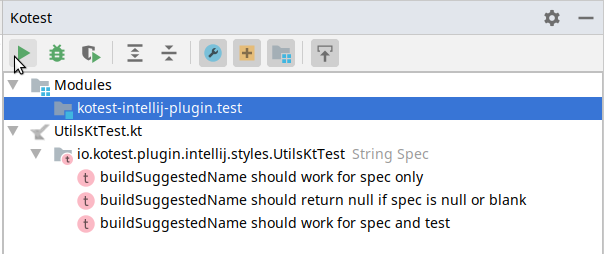

The plugin provides a tool window view which displays the structure of your tests.
The window describes the currently selected test file, which includes any specs defined in that file and tests
contained inside those specs. The tree layout will mirror the structure of your tests for easy navigation.

The tool window will include lifecycle callback methods (such as before / after test) if defined,
as well as included test factories.

Clicking on a spec, test, include or callback will navigate directly to that element in the source editor.

Any tests that have been disabled using the bang prefix will have a different icon.

You can execute (run/debug/run with coverage) a test or spec directly from this window. In addition, the window shows all test modules and allows you to run all tests in that module.

Modules, callbacks, and includes can be filtered out if you don't wish to see them. They are included by default.
