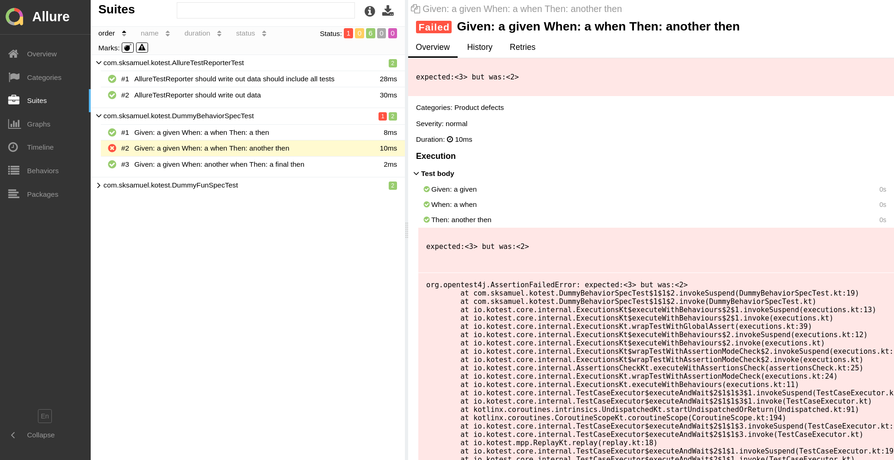

[Allure](https://qameta.io/allure-report/) is an open-source framework designed for detailed and interactive test reports.
It works by generating report files which are then used to create the final HTML report.
You can think of it as like the traditional JUnit report but more advanced and detailed.

:::tip
If you prefer to see an example rather than read docs, then there is a sample project [here](https://github.com/kotest/kotest-examples-allure)
:::

There are two steps to Allure. The first is to generate the raw data when executing tests, the second is to
compile that data into the interactive HTML report.

This module provides integration for using Allure with Kotest.
To start, add the below dependency to your Gradle build file.

```groovy
io.kotest.extensions:kotest-extensions-allure:${kotest.version}
```

[](https://search.maven.org/artifact/io.kotest.extensions/kotest-extensions-allure)
[](https://oss.sonatype.org/content/repositories/snapshots/io/kotest/extensions/kotest-extensions-allure/)


Note: The group ID is different (`io.kotest.extensions`) from the main Kotest dependencies (`io.kotest`).


### Collect Data

Allure has data collectors for most test frameworks and this module provides the integration for Kotest.
Once the module has been added to your build, wire in the `AllureTestReporter` class globally
using [project config](../framework/project_config.md).

```kotlin
class MyConfig : AbstractProjectConfig {
    override fun listeners() = listOf(AllureTestReporter())
}
```

Now, whenever tests are executed, Kotest will produce test reports in the Allure JSON format.


### Gradle Plugin

Now that the tests have completed, we can compile them into
the [final report](https://docs.qameta.io/allure/#_report_generation).

This can be done manually using the Allure binary, or we can use
the [Allure Gradle plugin](https://github.com/allure-framework/allure-gradle). To use the Gradle plugin, first add the
plugin to your build's plugins block.

```kotlin
plugins {
  ...
  id("io.qameta.allure") version "2.11.2"
}
```

Next, add an Allure configuration section to set the version and disable autoconfigure (because Allure can only 
autoconfigure JUnit, and Kotest takes care of this for you anyway).

```kotlin
allure {
  autoconfigure = false
  version = "2.13.1"
}
```

Finally, execute the Gradle task `allureReport` and the report will be generated in `./build/reports/allure-report` and
inside you should find the `index.html` entry point for the report.

### Manually setting result directory

If you are not using the Gradle plugin then you will need to inform Allure where the results directory is by setting
the `allure.results.directory` system property on your test task configuration. If you are using the Gradle plugin, then
this can be skipped as the Gradle plugin does this for you.

For example:

```
tasks.named<Test>("test") { // or "jvmTest" etc
   useJUnitPlatform()
   systemProperty("allure.results.directory", project.buildDir.toString() + "/allure-results")
}
```

### Final Report

If all was successful, after test execution and report generation, you will see something like this:


