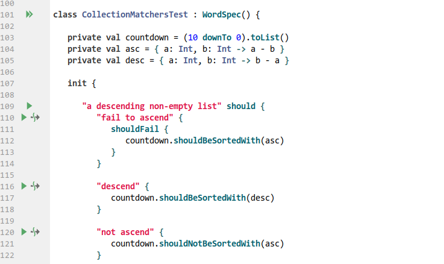

Release 4.1
======

The Kotest team is pleased to announce the release of Kotest 4.1.0.
This minor feature release is packed with goodies including the first public release of the Intellij plugin.
In this blog post we'll cover some of the more notable features and changes but for the full list see the [changelog](../changelog.md).

### Kotest Plugin

Let's start with the most exciting news. As part of the 4.1.0 release cycle, we've released the first public version
of the [Kotest plugin for Intellij](https://plugins.jetbrains.com/plugin/14080-kotest). The plugin is available in the Jetbrains plugin repository, so hop on over to
settings -> plugins and search for "kotest".


As this is the first release that will be used by the majority of users, bugs will likely be found. If you do encounter
an issue, please open a ticket [here](https://github.com/kotest/kotest-intellij-plugin).

The plugin provides gutter run icons for specs, top level tests, and nested tests.



The plugin additionally provides a tool window view which displays the structure of your tests.
The window describes the currently selected test file, which includes any specs defined in that file and tests
contained inside those specs. The tree layout will mirror the structure of your tests for easy navigation.

The tool window will include lifecycle callback methods (such as before / after test) if defined,
as well as included test factories.

Clicking on a spec, test, include or callback will navigate directly to that element in the source editor.


For full details on the features provided by the plugin, check out the [readme](https://github.com/kotest/kotest-intellij-plugin).

**Note:** In order to support this plugin, the behind the scenes code that fooled Intellij into thinking Kotest specs
were Junit tests has been removed. This means that unless you have the plugin installed, you won't see the green
play icon anymore on the class name.


### Kotlintest aliases removed

With release 4.0 of Kotest, the project was renamed from Kotlintest. To aid migration, we created aliases from the kotlintest
packages to the kotest packages for common imports.

With the release of 4.1 these aliases have been removed.

### Highlight diff when comparing data classes

When comparing two data classes for equality, previously you had to look through the fields to see which one(s) didn't match up.
Instead now, the failure output will highlight the differences for you.

For example, given the following data class:

```kotlin
data class Foo(val a: String, val b: Boolean, val c: Double)
```

And then executing this:

```kotlin
val a = Foo("hello", true, 1.0)
val b = Foo("world", true, 1.3)
a shouldBe b
```

Will give the following output:

```
data class diff for Foo
Expected :Foo(a=world, b=true, c=1.3)
Actual   :Foo(a=hello, b=true, c=1.0)
<Click to see difference>

org.opentest4j.AssertionFailedError: data class diff for Foo
├ a: expected:<"world"> but was:<"hello">
└ c: expected:<1.3> but was:<1.0>
```


### Integration with Testcontainers

[Testcontainers](https://www.testcontainers.org/) is a popular Java library that supports lightweight, throwaway instances of databases,
message queues, elasticsearch and so on. And now Kotest has a module that allows easy integration into the test lifecycle.

Add the `kotest-extensions-testcontainers` module to your build and then you can register a test container like this:

```kotlin
val testStartable = SomeTestContainer()
listeners(testStartable.perTest())
```

Notice the .perTest() function which creates a listener that will stop and start the container between tests. If you want a container
that only starts and stops once per spec, then use the following:

```kotlin
val testStartable = SomeTestContainer()
listeners(testStartable.perSpec())
```


### 'x' variants for Specs

The popular javascript frameworks and RSpec in Ruby have popularized the `describe` / `it` layout style for tests.
Kotest has supported this since version 1.0 in the form of the `DescribeSpec.` These other frameworks also provide
an easy way to disable a test, by replacing `describe` with `xdescribe` and `it` with `xit`. Kotest also supports this.

Starting with 4.1 Kotest now rolled out the same functionality to the other styles. For example, you can disable a given
block in `BehaviorSpec` by using `xgiven`, you can describe a context block in `FunSpec` with `xcontext` and so on.

A full example in the `FunSpec` style.

```kotlin
class MyFunSpec : FunSpec({
  xtest("a disabled test") {
    // this test will not be invoked
  }
  xcontext("this context is disabled") {
     test("and so this test is by extension") {
     }
  }
})
```

See full details on the [styles page](../framework/styles.md).

### Removing test prefixes from test output

Following on from the previous section, when you use certain specs, the test names are prefixed with `Describe:`, or `Feature:` and so on in the output.

This adds extra noise to the output and in retrospect should not have been added. Starting with 4.1 you can now disable these
_test prefixes_ by setting `includeTestScopePrefixes` to false in your [project config](../framework/project_config.md).

**Note:** In 4.2.0 this setting will be true by default.

### Invocation level timeouts

Kotest has the option to apply a timeout to your tests through config on the test case.

```kotlin
test("some test").config(timeout = 3000.milliseconds) { }
```

This timeout applies to all invocations of that test case. So if you have invocations set greater than 1, then the timeout
is shared between all invocations. Starting with 4.1 you can now apply a timeout at the invocation level.

```kotlin
test("some test").config(timeout = 3000.milliseconds,
                         invocationTimeout = 250.milliseconds,
                         invocations = 10) { }
```


### Parallel test execution

Kotest has for a long time, had the ability to run specs in parallel. Starting with 4.1 you can run individual test cases in parallel.
Override the `threads` val inside your spec class to greater than 1. Note: This feature is experimental and only applies to the single instance isolation mode.

### All scopes are now coroutine scopes

Leaf test cases have always been coroutine scopes since release 3.2 of Ko(tlin)Test. This means you can _launch_ a coroutine directly in the test
block without needing to provide a scope like `GlobalScope` or your own instance of `CoroutineScope`.

```kotlin
test("some test") {
  launch {
    delay(100)
  }
}
```

Previously, parent scopes in test styles that allow nesting, were not themselves coroutine scopes. This has been changed in 4.1.

Now you can write a test like this:

```kotlin
describe("some test") {
 launch {
    delay(100)
    it("should do something") {
       launch {
          delay(100)
       }
    }
  }
}
```

### Make beforeProject and afterProject as suspend function

Another feature that was more an oversight than anything else - the `beforeProject` and `afterProject` callbacks inside `ProjectListener` are now suspendable functions.


### Assert softly with receiver

You might already be using `assertSoftly` to allow a test to finish before throwing all the failures at once. Now you can do the same but with a receiver.

For example, rather than write

```kotlin
val person = ...
assertSoftly {
  person.name shouldBe "sam"
  person.age shouldBe 99
  person.city shouldBe "Chicago"
}
```

You can now do:

```kotlin
val person = ...
person.assertSoftly {
  name shouldBe "sam"
  age shouldBe 99
  city shouldBe "Chicago"
}
```


### Better shrink information

If you're using the [property test framework](https://github.com/kotest/kotest/blob/master/doc/property_testing.md) you'll notice the improved shrinking output. This now includes both
the reason for the original failure (with the original args) and the reason for the shrunk failure (with the
shrunks args).

For example, given a silly test that checks that any string reversed is the same as the input string:

```kotlin
checkAll<String> { a ->
  a shouldBe a.reversed()
}
```

This will be true for the empty string and all single char strings, and then false for most other strings.

```
Property test failed for inputs

0) "!s:?XBy;pq?`$3V70cqoO$zlO&%bUwafP1nF73gMeyQ[RzehtY36"

Caused by org.opentest4j.AssertionFailedError: expected:<"63YthezR[QyeMg37Fn1PfawUb%&Olz$Ooqc07V3$`?qp;yBX?:s!"> but was:<"!s:?XBy;pq?`$3V70cqoO$zlO&%bUwafP1nF73gMeyQ[RzehtY36"> at
	com.sksamuel.kotest.property.ForAll2Test$1$1$1.invokeSuspend(ForAll2Test.kt:19)
	com.sksamuel.kotest.property.ForAll2Test$1$1$1.invoke(ForAll2Test.kt)
	io.kotest.property.internal.ProptestKt$proptest$$inlined$forEach$lambda$1.invokeSuspend(proptest.kt:28)
	io.kotest.property.internal.ProptestKt$proptest$$inlined$forEach$lambda$1.invoke(proptest.kt)

Attempting to shrink arg "!s:?XBy;pq?`$3V70cqoO$zlO&%bUwafP1nF73gMeyQ[RzehtY36"
Shrink #1: "!s:?XBy;pq?`$3V70cqoO$zlO&" fail
Shrink #2: "!s:?XBy;pq?`$" fail
Shrink #3: "!s:?XBy" fail
Shrink #4: "!s:?" fail
Shrink #5: "!s" fail
Shrink #6: "!" pass
Shrink #7: "as" fail
Shrink #8: "a" pass
Shrink #9: "s" pass
Shrink #10: "aa" pass
Shrink result (after 10 shrinks) => "as"

Caused by org.opentest4j.AssertionFailedError: expected:<"sa"> but was:<"as"> at
	com.sksamuel.kotest.property.ForAll2Test$1$1$1.invokeSuspend(ForAll2Test.kt:19)
	com.sksamuel.kotest.property.ForAll2Test$1$1$1.invoke(ForAll2Test.kt)
	io.kotest.property.internal.ShrinkfnsKt$shrinkfn$1$invokeSuspend$$inlined$with$lambda$1.invokeSuspend(shrinkfns.kt:19)
	io.kotest.property.internal.ShrinkfnsKt$shrinkfn$1$invokeSuspend$$inlined$with$lambda$1.invoke(shrinkfns.kt)
```

### Property Test Listeners

The `forAll` and `checkAll` property test functions accept a `PropTestConfig` object to configure a property test.
This object now contains a listeners field, to which you can attach `PropTestListener` instances. This allows you to
run setup / teardown code before and after a property test, like you can for regular tests.

For example.

```kotlin
val listener = object : PropTestListener {
  override suspend fun beforeTest() {
    println("Startup")
  }

  override suspend fun afterTest() {
    println("Shutdown")
  }
}

val propConfig = PropTestConfig(listeners = listOf(listener))

checkAll<String, String>(10, propConfig) { a, b ->
  a.length + b.length shouldBe (a + b).length
}
```


### Thanks

Huge thanks to all who contributed to this release.

AJ Alt, Albert Attard, Amy, Ashish Kumar Joy, ataronet, Attila Domokos, bbaldino, bright_spark, Caroline Ribeiro, Christian Nedregård, crazyk2, George Wilkins, Harry JinHyeok Kang, James Pittendreigh, Leonardo Colman Lopes, Lyall Jonathan Di Trapani, Martin Nonnenmacher, Maxime Suret, mwfpope, Nikita Klimenko, Nimamoh, Octogonapus, Paul, Robert Macaulay, Robert Stoll, Ron Gebauer, Sebastian Schuberth, Sergei Bulgakov, sharmabhawna, sksamuel, Steffen Rehberg
