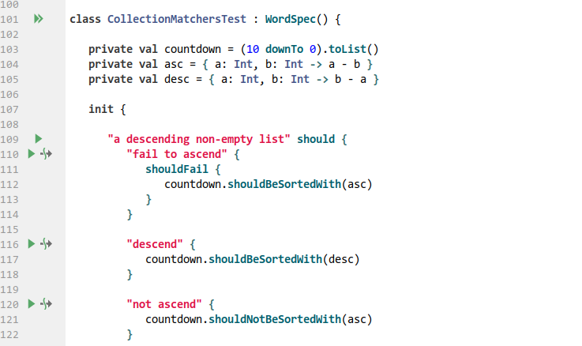
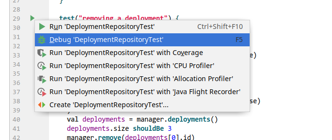
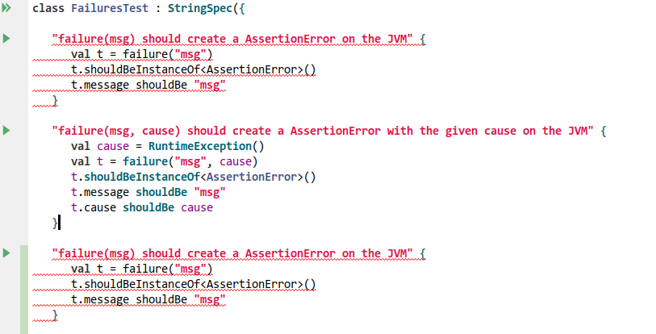

# kotest-intellij-plugin


The official [Kotest plugin](https://plugins.jetbrains.com/plugin/14080-kotest) for Intellij and Android Studio

## Getting Started

This plugin requires Kotest 4.1.0 or above.

```kotlin
  val kotestVersion = "4.1.3" or "4.2.6"
  
  // and then the kotlin dependencies
  dependencies {
    ...
    testImplementation("io.kotest:kotest-assertions-core-jvm:$kotestVersion") // optional, for kotest assertions
    testImplementation("io.kotest:kotest-runner-junit5-jvm:$kotestVersion") // required
  }
  
  tasks.withType<Test> { useJUnitPlatform() }
```

## Gutter Icons

The plugin provides gutter run icons for specs, top level tests, and nested tests.



Any tests disabled via a bang or by _xfunctions_ such as `xdescribe`, will have a disabled test icon in the gutter.


## Running Tests

If you execute a spec from the gutter icon, then all tests in that spec will be executed.
If you execute a test, then that test and all nested tests will be executed.



## Tool Window

The plugin provides a tool window view which displays the structure of your tests.
The window describes the currently selected test file, which includes any specs defined in that file and tests
contained inside those specs. The tree layout will mirror the structure of your tests for easy navigation.


The tool window will include lifecycle callback methods (such as before / after test) if defined,
as well as included test factories.


Clicking on a spec, test, include or callback will navigate directly to that element in the source editor.

Any tests that have been disabled using the bang prefix will have a different icon.


You can execute (run/debug/run with coverage) a test or spec directly from this window. In addition, the window shows all test modules and allows you to run all tests in that module.


Modules, callbacks, and includes can be filtered out if you don't wish to see them. They are included by default.

## Duplicated Test Highlighting

You cannot have two tests with the same name. The plugin will highlight any duplicated test names as errors.



## Context Menu Run / Debug

Right clicking on a package will allow you to run, debug or run with coverage all the tests inside that package.


## Intentions

This plugin has some basic intentions. For example, you can quickly mark a test as disabled.


Or you can highlight some text and mark it as should throw, or surround with a soft assertion block.


